  # 安装指南
  ## 准备
  -   推荐内存4G  硬盘30G以上 
  -   安装java1.8运行环境。
  ## 安装
  ####  数据库初始化
  本程序使用mysql 8.011
  创建数据库resource_manage ,设置utf-8编码 utf8_general_ci 排序规则.
  数据库初始化sql脚本在本项目src\main\resources\db\resource_manage.sql
   在数据库执行即可.
   另需要在kubernetes-manage.yaml文件中修改数据库配置 
   
 #### 运行成功后 k8s配置
  需要在被管理的k8s集群master节点中,config配置文件.
   一般在 用户主目录下 .kube/config,如果还没有安装kubectl就没有该文件.如果参考下面方式安装,安装后即可找到.

####  安装kubectl命令行工具
下载和配置 kubernetes 集群命令行工具 kubelet 的步骤。
下载 kubectl
注意请下载对应的Kubernetes版本的安装包。本文以1.8版本为例
具体版本参考官网更新
https://kubernetes.io/zh/docs/setup/release/notes/

```
wget https://dl.k8s.io/v1.18.0/kubernetes-client-linux-amd64.tar.gz -xzvf kubernetes-client-linux-amd64.tar.gzcp kubernetes/client/bin/kube* /usr/bin/chmod a+x /usr/bin/kube*
```

创建 kubectl kubeconfig 文件

```
export  KUBE_APISERVER="https://<主节点ip>:6443" 
# 设置集群参数

kubectl config set-cluster kubernetes \  --certificate-authority=/etc/kubernetes/ssl/ca.pem \  --embed-certs=true \  --server=${KUBE_APISERVER}
# 设置客户端认证参数
kubectl config set-credentials admin \  --client-certificate=/etc/kubernetes/ssl/admin.pem \  --embed-certs=true \  --client-key=/etc/kubernetes/ssl/admin-key.pem
# 设置上下文参数
kubectl config set-context kubernetes \  --cluster=kubernetes \  --user=admin
# 设置默认上下文kubectl config use-context kubernetes
```

admin.pem 证书 OU 字段值为 system:masters，kube-apiserver 预定义的 RoleBinding cluster-admin 将 Group system:masters 与 Role cluster-admin 绑定，该 Role 授予了调用kube-apiserver 相关 API 的权限；
生成的 kubeconfig 被保存到 ~/.kube/config 文件；
注意：~/.kube/config文件拥有对该集群的最高权限，请妥善保管。
 
#### 关于api接口与文档
本程序安装后.可以通过安装后集群ip与暴露的端口访问

开发文档: ip:port(域名)/swagger-ui/html/all.html

接口文档: ip:port(域名)/swagger-ui.html

#### 环境配置
程序启动后,如果连接数据库库正常.
在前端界面上可以配置环境信息.如下
进入微服务系统,点击k8s资源管理-环境配置.新增环境信息.将上面准备好的k8sconfig文件录入,保存即可.

#### k8s yaml方式部署配置
yaml 部署文件在项目根目录 kubernetes-manage.yaml 中
其中 MYSQL_SERVICE_HOST 为mysql服务器ip
- MYSQL_SERVICE_PORT 为mysql 端口号
- USER_NAME  为用户名
- PASSWORD   密码
- 对外暴露一个web请求端口80
---

> web可以使用域名绑定到此服务.
> 绑定的域名和nginx配置后的请求地址,需要配置到前端代码.并且,绑定的后端域名要和前端绑定域名在同一个域中.
#### websocket nginx配置
```
location /websocket/k8s/pod/log {
proxy_pass http://192.168.12.50:34061(代理服务器);
proxy_http_version 1.1;
proxy_connect_timeout 3600s ;
proxy_read_timeout 3600s ;
proxy_send_timeout 3600s ;
proxy_set_header Upgrade $http_upgrade ;
proxy_set_header Connection "upgrade" ;
proxy_redirect off;
proxy_set_header Host $host;
proxy_set_header X-Real-IP $remote_addr;
proxy_set_header X-Forwarded-For $proxy_add x_forwarded for;
}
```
#### springboot yml配置项
在application-prod.yml配置文件中
目前配置项默认是单环境.
如果需要支持添加多环境,可以修改kube.manyEnv: true
如果需要查询k8s api调用时的细节日志,可以修改kube.debugger:true

####  k8s资源管理前端部署说明
如果没有前端访问域名,需要先准备域名,
源码src/libs/util.js
util.k8sDom = www.xxx.com(后端访问域名)
域名不需要加前缀与后缀,正式环境修改此项最后的参数.


#  k8s资源管理用户手册

## k8s概况

总体概况可查看指定环境-Namespace中的常用资源的运行状态、列表清单，同时可以在清单中直接对资源进行修改、删除、查看详情以及其他特定操作(如扩缩容、查看pod日志)。

集群管理员可查看到集群内的所有资源，资深用户只能在总体概况中查看到属于自己Namespace权限的资源。

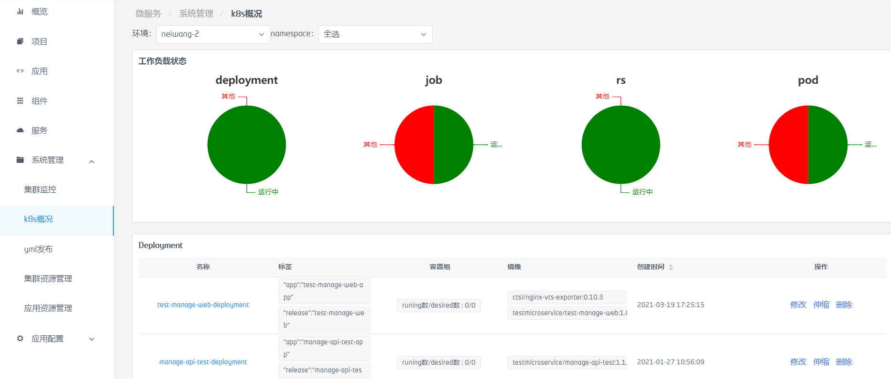

## yml发布

K8s资源可通过直接粘贴文本内容，或者上传文件的方式发布。上传点击确认后，系统校验内容无误后再发布相应的资源。

集群资源发布支持的类型有：Namespace、PersistentVolume、StorageClass、CustomResourceDefinition、ServiceAccount、ClusterRole、ClusterRoleBinding。集群资源只能由集群管理员发布。

应用资源发布支持的类型有：Deployment、Cronjob、Job、Statefulset、ReplicaSet、Replication Controller、Daemonset、Pod、PersistentVolumeClaim、Configmap、Secret、Service、Ingress。应用资源可由集群管理员或相应Namespace权限的资深用户发布

集群管理员可选择发布的资源类型是集群资源或应用资源

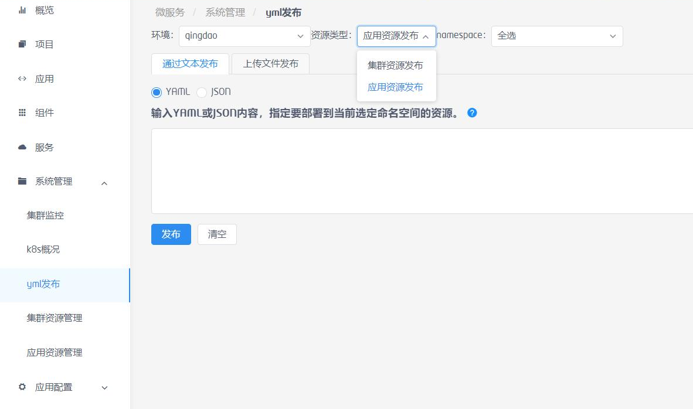

资深用户只能默认发布应用资源，不能选择大类。

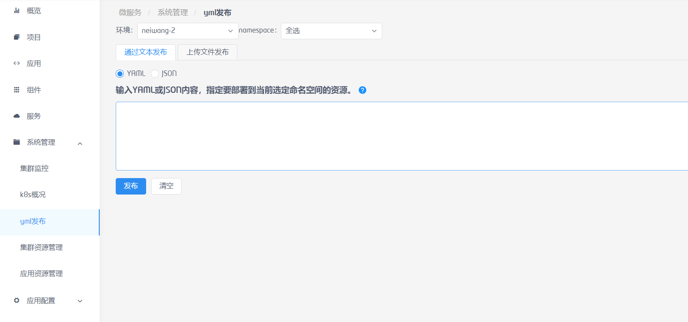

 

发布时，如果yaml中的namespace与系统中选择的不一致，会提示以系统中选择的Namespace为准。防止将资源发布到权限范围外的Namespace中。

*注：系统目前版本，一次发布操作只能同时发布一个资源。

## 集群资源管理

集群资源包括Namespace、节点(Node)、持久化存储卷(PV)、角色(Role)、存储类(StorageClass)、自定义资源(CRD)。一般由集群管理员操作。

集群管理员可查看、修改、删除指定集群的集群资源，资深用户只能查看集群资源的列表和详情，如果集群资源的详情中存在关联的其它应用资源，资深用户只能够查看到属于自己Namespace权限的资源。

### Namespace

通过集群资源管理-环境-Namespace，查看指定环境下的Namespace资源列表

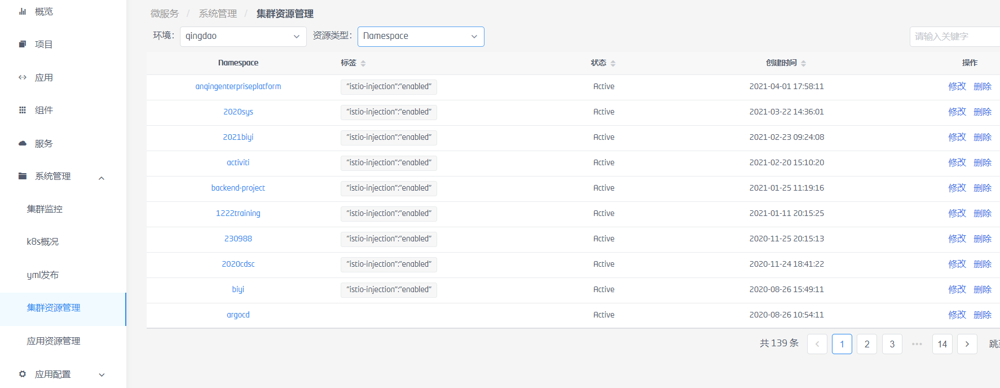

点击名称可查看资源的详细信息。

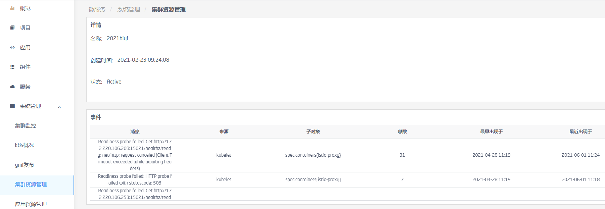

点击“修改”，弹出yaml信息，可修改后保存。

点击“删除”，可删除Namspace，同时删除该Namespace下所有资源。

Namespace只能由集群管理员或有该Namespace权限的资深用户操作。

### 节点

通过集群资源管理-环境-节点，查看指定环境下的节点资源列表。

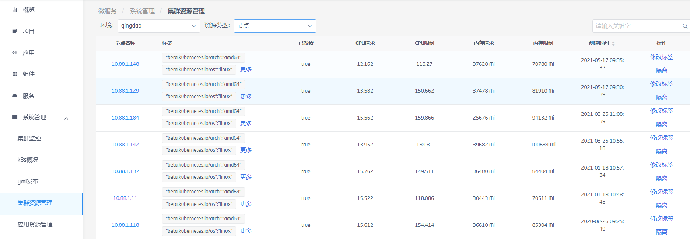

点击节点名称，可查看改节点的详细信息。同事可以查看到改节点已分配的CPU、内存、可运行pod个数的情况；改节点上运行的pod清单

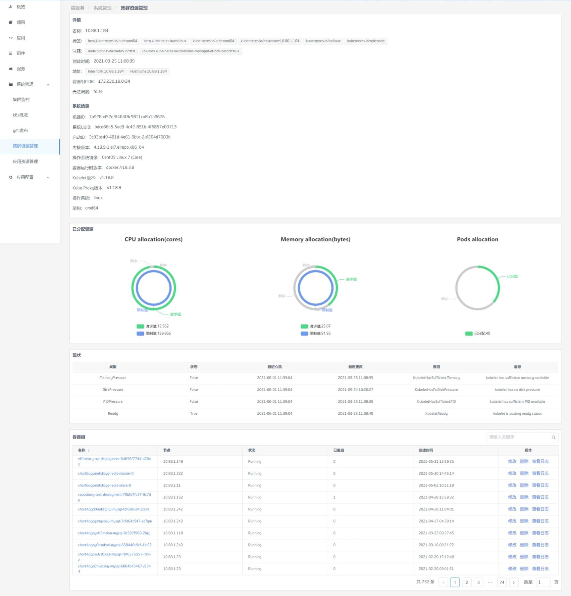 

管理员用户可以点击“修改标签”，弹出改节点的label信息，可修改后保存来修改节点标签。

管理员用户当需要禁止节点调度时，可点击相应节点的隔离按钮，来实现调度隔离。隔离后可点击恢复按钮恢复。

### 持久化存储卷

通过集群资源管理-环境-持久化存储卷，查看指定环境下的持久化存储卷资源列表。

点击名称可查看资源的详细信息。

管理员用户可以点击“修改”，弹出yaml信息，修改后保存更新资源。

管理员用户可以点击“删除”，可删除相应资源。

### 角色

通过集群资源管理-环境-角色，查看指定环境下的角色资源列表。

点击名称可查看资源的详细信息。

管理员用户可以点击“修改”，弹出yaml信息，可修改后保存。

管理员用户可以点击“删除”，可删除相应资源。

### 存储类

通过集群资源管理-环境-存储类，查看指定环境下的存储类资源列表。

点击名称可查看资源的详细信息。

管理员用户可以点击“修改”，弹出yaml信息，修改后保存更新资源。

管理员用户可以点击“删除”，可删除相应资源。

### 自定义资源(CRD)

通过集群资源管理-环境-CRD，查看指定环境下的CRD资源列表。

点击名称可查看资源的详细信息。

管理员用户可以点击“修改”，弹出yaml信息，修改后保存更新资源。

管理员用户可以点击“删除”，可删除相应资源。

 

## 应用资源管理

应用资源管理的对象包括deployment、pod、RS、RC、Job、DaemonSet、Statefulset、Ingresses、Service、PVC、Configmap等资源。用户可根据权限查看指定namesapce下的资源状况和详细信息。并可以对资源的yaml进行修改更新和删除操作。

应用资源管理可由资深用户操作指定的Namespace下的资源。

### Deployment

通过应用资源管理-环境-workloads/deployment，查看指定环境下的Deployment资源列表。

标签信息较长，可点击“更多”查看完整的标签信息。

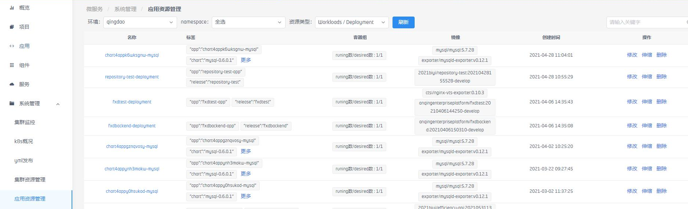


点击资源名称可查看资源的详细信息，详细信息中可查看到deployment相关联的资源。

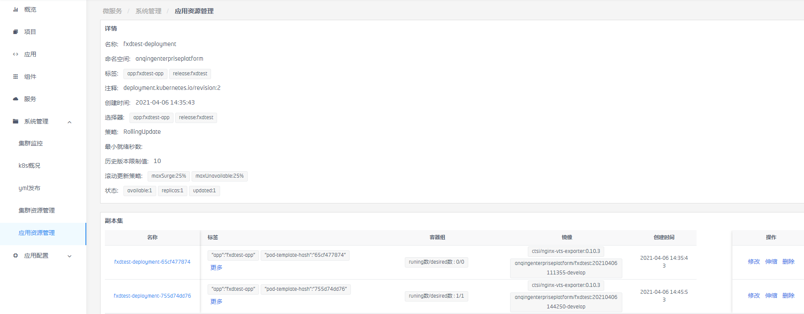

 

点击“修改”，弹出yaml信息，修改后保存更新资源。

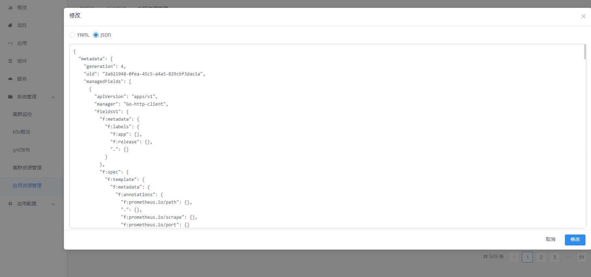

如果需要对Deployment的pod数进行扩容或缩容，点击相应deployment后的“伸缩”按钮，在弹出框中可看到当前的pod数量，修改需要的pod数量，然后保存即可。

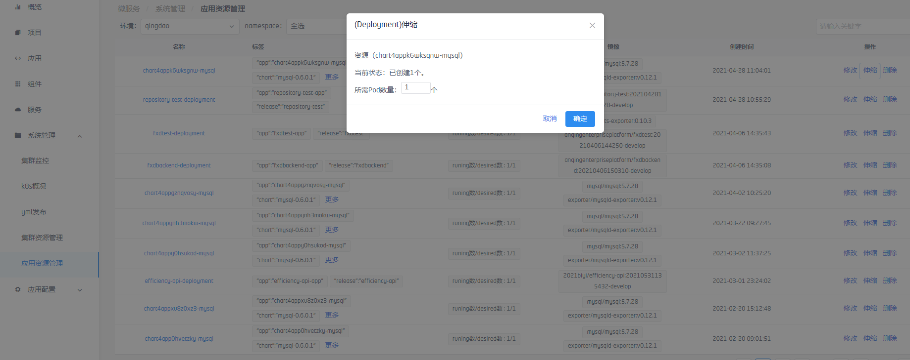

点击“删除”，确认后可删除该资源。

###  Cronjob

通过应用资源管理-环境-workloads/Cronjob，查看指定环境下的cronjob资源列表。

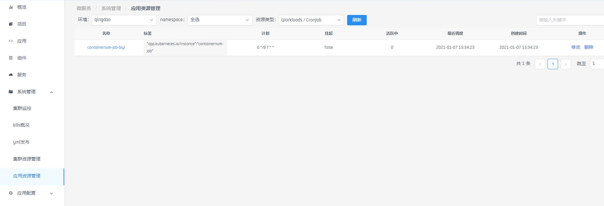

点击资源名称可查看资源的详细信息，详细信息中可查看到deployment相关联的资源。

点击“修改”，弹出yaml信息，修改后保存更新资源。

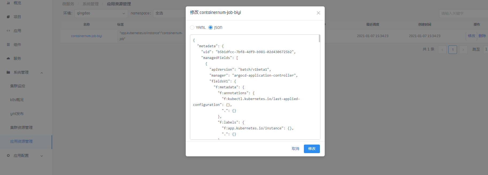

点击“删除”，确认后可删除该资源。

### Job

通过应用资源管理-环境-workloads/job，查看指定环境下的job资源列表。

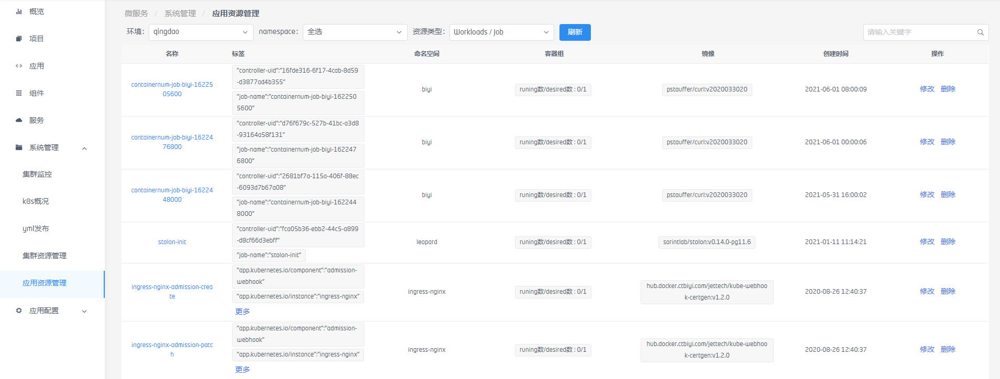

点击资源名称可查看资源的详细信息，详细信息中可查看到job相关联的资源。

点击“修改”，弹出yaml信息，修改后保存更新资源。

点击“删除”，确认后可删除该资源。

### Statefulset

通过应用资源管理-环境-workloads/Statefulset，查看指定环境下的Statefulset资源列表。

点击资源名称可查看资源的详细信息，详细信息中可查看到Statefulset相关联的资源。

点击“修改”，弹出yaml信息，修改后保存更新资源。

点击相应资源的“伸缩”按钮，在弹出框中可看到当前的pod数量，可修改需要的pod数量。

点击“删除”，确认后可删除该资源。

### RS

通过应用资源管理-环境-workloads/RS，查看指定环境下的RS资源列表。

点击资源名称可查看资源的详细信息，详细信息中可查看到RS相关联的资源。

点击“修改”，弹出yaml信息，修改后保存更新资源。

点击相应资源的“伸缩”按钮，在弹出框中可看到当前的pod数量，可修改需要的pod数量。

点击“删除”，确认后可删除该资源。

### RC

通过应用资源管理-环境-workloads/Statfulset，查看指定环境下的Statfulset资源列表。

点击资源名称可查看资源的详细信息，详细信息中可查看到Statfulset相关联的资源。

点击“修改”，弹出yaml信息，修改后保存更新资源。

点击相应资源的“伸缩”按钮，在弹出框中可看到当前的pod数量，可修改需要的pod数量。

点击“删除”，确认后可删除该资源。

### Daemonset

通过应用资源管理-环境-workloads/Daemonset，查看指定环境下的Daemonset资源列表。

点击资源名称可查看资源的详细信息，详细信息中可查看到Daemonset相关联的资源。

点击“修改”，弹出yaml信息，修改后保存更新资源。

点击“删除”，确认后可删除该资源。

### Pod

通过应用资源管理-环境-workloads/Pod，查看指定环境下的Pod资源列表。

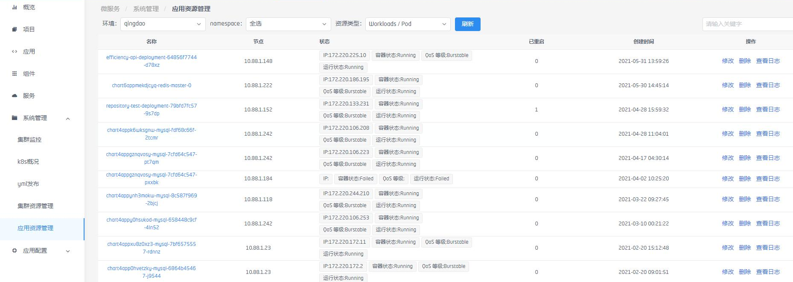


点击“修改”，弹出yaml信息，修改后保存更新资源。

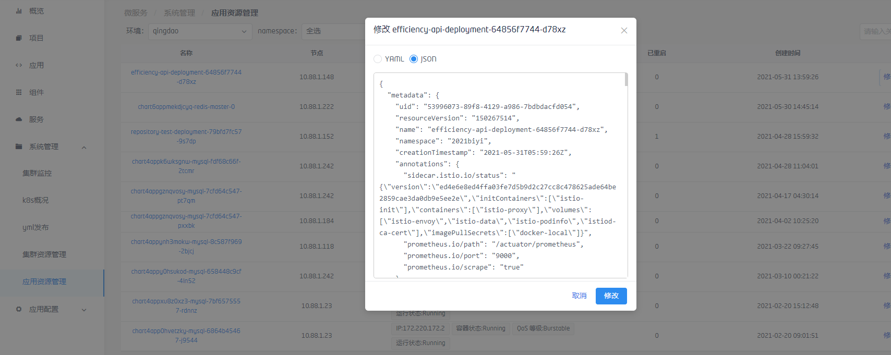

点击资源名称可查看Pod的详细信息，详细信息中可查看到Pod相关联的资源。

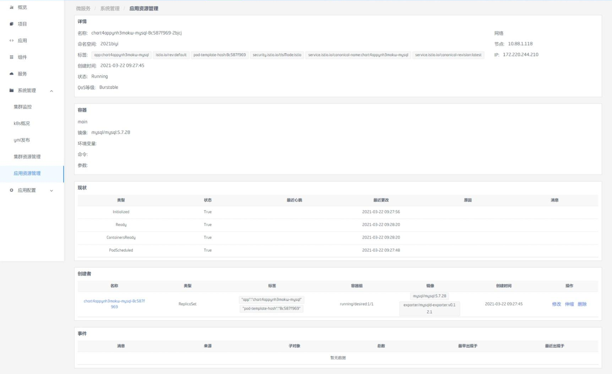

 

### PVC

通过应用资源管理-环境-Storage/PVC，查看指定环境下的PVC资源列表。

点击资源名称可查看资源的详细信息，详细信息中可查看到PVC相关联的资源。

点击“修改”，弹出yaml信息，修改后保存更新资源。

点击“删除”，确认后可删除该资源。

### Configmap

通过应用资源管理-环境-Configuration/Configmap，查看指定环境下的Configmap资源列表。

点击资源名称可查看资源的详细信息，详细信息中可查看到Configmap相关联的资源。

点击“修改”，弹出yaml信息，修改后保存更新资源。

点击“删除”，确认后可删除该资源。

### Secret

通过应用资源管理-环境-Configuration/Secret，查看指定环境下的Secret资源列表。

点击资源名称可查看资源的详细信息，详细信息中可查看到Secret相关联的资源。

点击“修改”，弹出yaml信息，修改后保存更新资源。

点击“删除”，确认后可删除该资源。

 

### Service

通过应用资源管理-环境-Network/Service，查看指定环境下的Service资源列表。

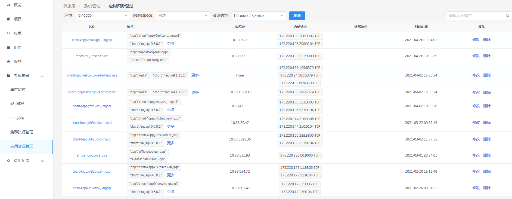

点击资源名称可查看资源的详细信息，详细信息中可查看到Service相关联的资源。

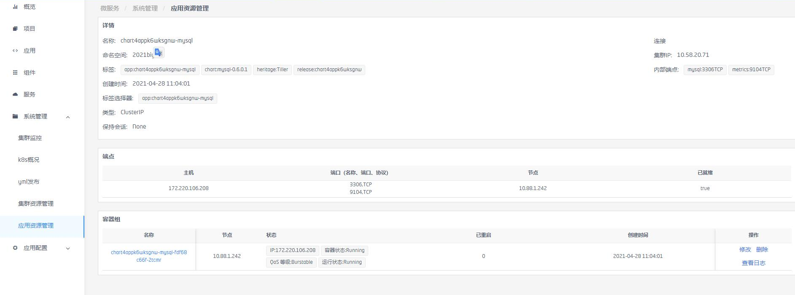

点击“修改”，弹出yaml信息，修改后保存更新资源。

点击“删除”，确认后可删除该资源。

### Ingress

通过应用资源管理-环境-Network/Ingress，查看指定环境下的Ingress资源列表。

点击资源名称可查看资源的详细信息，详细信息中可查看到Ingress相关联的资源。

点击“修改”，弹出yaml信息，修改后保存更新资源。

点击“删除”，确认后可删除该资源。

## 环境配置

环境配置用于配置需要访问到的k8s集群的配置文件，由集群管理员添加或更改。

环境配置列表

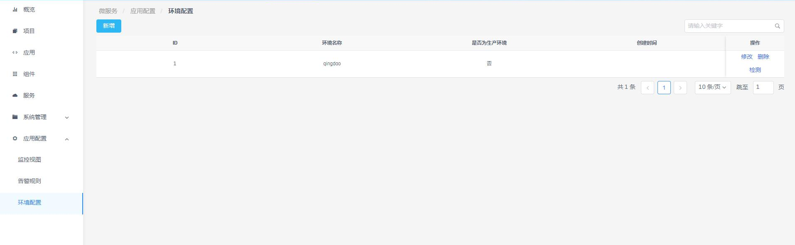

点击“新增”，输入环境的名称和K8s中的config.conf文件内容，点击确认即可添加新的K8s集群环境。

*注：系统目前版本，环境配置只能添加一个集群。

添加后点击检测按钮，检测K8s可正常连接后，即可使用资源管理的功能。

 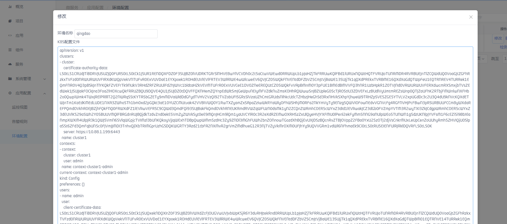

如果环境名称或认证文件需要变更，点击“修改”，修改内容保存即可。

